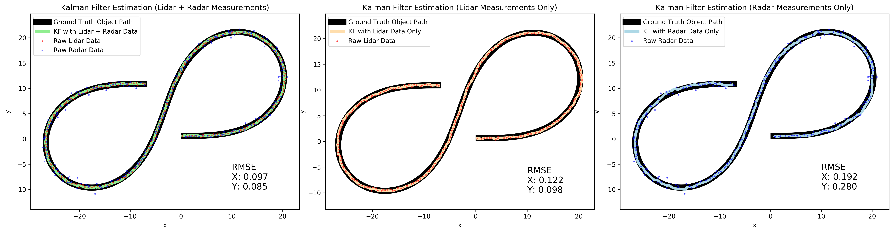
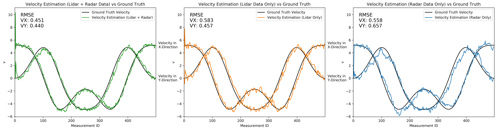

# **Extended Kalman Filter**

Project to track an object using an Extended Kalman Filter (EKF) and sensor data from Lidar and Radar sensors.

Installation guide: [INSTALLATION.md](INSTALLATION.md)  
Source code: [src/](src/)  

## Position Estimation with Extended Kalman Filter:

## Velocity Estimation with Extended Kalman Filter:

